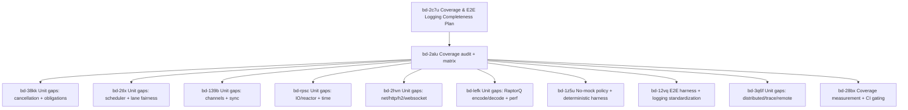

# Testing Guide

This document defines the test logging standards, categories, and execution
patterns for the Asupersync codebase. The goal is deterministic, explainable
failures with high-signal traces and minimal manual digging.

## Quick Commands

```bash
# Unit + integration tests
cargo test

# Stream logs
cargo test -- --nocapture

# Run a specific test file
cargo test --test http_verification

# Run a specific test by name (substring match)
cargo test cancellation_conformance
```

## Test Categories and Locations

- Unit tests: colocated under `src/` modules
- Integration tests: `tests/*.rs`
- E2E tests: `tests/e2e/**` (protocol stacks, cancel-correctness, tracing)
- Conformance suite: `conformance/` crate (runtime-agnostic suite)
- Fuzz tests: `fuzz/` (cargo-fuzz targets + corpora)
- Property tests: see `property-tests.yml` CI workflow and `tests/*.rs` files

## Artifact Bundle Layout + Samples (bd-1t58q)

When `ASUPERSYNC_TEST_ARTIFACTS_DIR` is set, failed tests emit a deterministic
artifact bundle under a sanitized test name directory. The harness also writes
a per-test JSON summary into the root artifact directory.

Failure artifacts (from `TestHarness::finish`):
- `event_log.txt`: human-readable event log summary
- `failed_assertions.json`: serialized list of failed assertions
- `repro_manifest.json`: deterministic repro manifest (see schema below)

Environment metadata (optional, from `TestEnvironment::write_metadata_artifact`):
- `environment.json`: OS/arch/seed/ports/services snapshot

Summary (always written when artifacts are enabled):
- `<test_name>_summary.json`: per-test summary and event stats

Example bundle layout:

```text
$ASUPERSYNC_TEST_ARTIFACTS_DIR/
  cancellation_conformance/
    event_log.txt
    failed_assertions.json
    repro_manifest.json
    environment.json
  cancellation_conformance_summary.json
```

Example structured log entry (start/end markers include the same context):

```text
INFO test_start test_id="cancellation_conformance" seed=0xDEADBEEF subsystem="cancellation" invariant="losers_drained"
```

Repro manifest schema (current fields):
- `schema_version` (u32)
- `seed` (u64, root seed)
- `scenario_id` (string)
- `entropy_seed` (optional u64)
- `config_hash` (optional string)
- `trace_fingerprint` (optional string)
- `input_digest` (optional string)
- `oracle_violations` (string array)
- `passed` (bool)
- `subsystem` (optional string)
- `invariant` (optional string)
- `trace_file` (optional string)
- `input_file` (optional string)
- `env_snapshot` (array of key/value tuples)
- `phases_executed` (string array)
- `failure_reason` (optional string)

Sample `repro_manifest.json`:

```json
{
  "schema_version": 1,
  "seed": 57005,
  "scenario_id": "cancellation_conformance",
  "entropy_seed": 48879,
  "config_hash": "cfg_hash_v1",
  "trace_fingerprint": "trace_fp_v1",
  "input_digest": "input_digest_v1",
  "oracle_violations": ["losers_drained", "no_obligation_leaks"],
  "passed": false,
  "subsystem": "cancellation",
  "invariant": "losers_drained",
  "trace_file": "traces/run.jsonl",
  "input_file": "inputs/failing.json",
  "env_snapshot": [["ASUPERSYNC_LAB", "1"], ["RUST_LOG", "info"]],
  "phases_executed": ["setup", "execute", "verify"],
  "failure_reason": "losers_drained: expected=true, actual=false"
}
```

## Coverage Completeness Plan (bd-2c7u)

This section defines what "complete" means for testing coverage and logging.
It is a plan and checklist for the epic, not the final audit matrix.

Completeness means:
- Every subsystem lists explicit invariants and has at least one unit test per invariant.
- Every cross-subsystem interaction has an integration test that exercises real components.
- Every major protocol stack has at least one E2E test with deterministic logs and traces.
- Every test run is deterministic under lab runtime or documented as intentionally wall-clock.
- No mocks or fakes are used where lab runtime, deterministic drivers, or real components exist.

Matrix fields for the audit task (bd-2alu):
- Subsystem and ownership (module path).
- Invariants (named, testable claims).
- Unit tests (file + test name).
- Integration tests (file + test name).
- E2E tests (file + test name).
- Logging and trace expectations (required markers, seeds, trace artifacts).
- Gaps and priority (what is missing, impact, suggested bead).

Subsystems in scope:
- Runtime and scheduler (lanes, fairness, stealing, quiescence).
- Cancellation and obligations (request, drain, finalize, leak-free).
- Channels and sync primitives.
- IO/reactor/time drivers.
- Net/http/h2/websocket transport.
- RaptorQ codec and pipelines.
- Distributed and remote execution.
- Trace/record/replay and DPOR.
- Security and capability boundaries.

Invariants to map (non-exhaustive baseline):
- Region close implies quiescence.
- No task leaks.
- No obligation leaks.
- Losers drained after races.
- Cancellation protocol is request -> drain -> finalize.
- Deterministic lab runtime with seed-stable traces.
- Bounded cleanup with explicit budgets.

## Coverage Audit Matrix (bd-2alu)

This is the current audit matrix mapping subsystems and invariants to tests.
It favors deterministic lab runtime where possible and calls out gaps where
coverage is missing or relies on mocks.

| Subsystem | Invariants (examples) | Unit tests (src/) | Integration tests (tests/) | E2E tests (tests/e2e/) | Logging/trace expectations | Gaps / notes |
| --- | --- | --- | --- | --- | --- | --- |
| Runtime + scheduler | Lane priority, fairness, no orphan tasks, region close = quiescence | `src/runtime/scheduler/three_lane.rs::test_cancel_priority_over_ready`, `src/runtime/scheduler/three_lane.rs::test_stealing_only_from_ready_lane`, `src/runtime/scheduler/mod.rs::test_worker_shutdown` | `tests/scheduler_lane_fairness.rs::test_ready_not_starved_by_cancel_flood`, `tests/scheduler_backoff.rs::test_scheduler_shutdown_with_backoff`, `tests/scheduler_regression.rs::regression_throughput_10k_schedule_pop`, `tests/phase0_verification.rs::e2e_nested_region_quiescence_oracles` | `tests/runtime_e2e.rs::e2e_task_spawn_and_quiescence` | `init_test_logging`, `test_phase!` in scheduler and runtime tests | Unit gap task tracked in `bd-2tlx` |
| Cancellation + obligations | Request -> drain -> finalize, no obligation leaks, losers drained | `src/cancel/symbol_cancel.rs::test_token_cancel_once`, `src/cancel/symbol_cancel.rs::test_token_child_inherits_cancellation`, `src/obligation/leak_check.rs::clean_reserve_commit`, `src/obligation/graded.rs::obligation_commit_clean` | `tests/cancellation_conformance.rs::cancel_request_on_running_task`, `tests/cancellation_conformance.rs::cancel_finalize_phase_entered`, `tests/cancel_attribution.rs::cancel_reason_basic_construction`, `tests/io_cancellation.rs::io_cancel_001_cancel_during_read` | `tests/e2e/combinator/cancel_correctness/obligation_cleanup.rs::test_loser_permit_resolved` | Cancellation tests should emit phase markers for checkpoints and drain | Unit gap task tracked in `bd-38kk` |
| Channels + sync primitives | No permit/ack leaks, bounded drain, correct wakeups | `src/channel/mpsc.rs::basic_send_recv`, `src/channel/mpsc.rs::fifo_ordering_single_sender`, `src/sync/semaphore.rs::new_semaphore_has_correct_permits` | `tests/channel_conformance.rs::run_conformance_tests`, `tests/sync_conformance.rs::sync_001_mutex_basic_lock_unlock`, `tests/stream_e2e.rs::test_basic_stream_iteration` | `tests/e2e_messaging.rs::e2e_mpsc_queue_delivery` | Trace markers around reserve/commit and drain | Unit gap task tracked in `bd-139b` |
| IO + reactor + time | Readiness registration, cancellation behavior, deadline/timeout correctness | `src/time/sleep.rs::new_creates_sleep_with_deadline`, `src/time/sleep.rs::after_computes_deadline`, `src/runtime/reactor/registration.rs::drop_deregisters` | `tests/io_cancellation.rs::io_cancel_001_cancel_during_read`, `tests/io_uring_reactor.rs::reactor_creates_successfully`, `tests/time_e2e.rs::test_sleep_new_creates_with_deadline` | `tests/e2e_fs.rs::e2e_file_create_write_read_roundtrip` | Must log timer wheel steps and cancellation injection points | Unit gap task tracked in `bd-rpsc` |
| Net + HTTP + H2 + WebSocket + gRPC | Protocol correctness, error coverage, security hardening | `src/http/h1/codec.rs::decode_simple_get`, `src/net/websocket/handshake.rs::test_compute_accept_key` | `tests/http_verification.rs::body_full_lifecycle`, `tests/h2_security.rs::hpack_integer_overflow_rejected`, `tests/grpc_verification.rs::grpc_verify_001_code_i32_roundtrip`, `tests/net_tcp.rs::net_tcp_001_basic_connect_accept` | `tests/e2e_websocket.rs::ws_url_parse_basic_ws`, `tests/e2e_web.rs::e2e_route_resolution_and_method_dispatch` | Expect per-protocol `test_phase!` markers and deterministic traces | Unit gap task tracked in `bd-2hvn` |
| RaptorQ codec + pipelines | Encode/decode correctness, matrix constraints, determinism and perf bounds | `src/raptorq/decoder.rs::decode_all_source_symbols`, `src/raptorq/systematic.rs::params_small`, `src/encoding.rs::test_encode_small_data` | `tests/raptorq_conformance.rs::roundtrip_no_loss`, `tests/codec_e2e.rs::e2e_codec_001_lines_multi_decode` | `tests/raptorq_conformance.rs::roundtrip_no_loss` | Deterministic seeds and block params logged for encode/decode | Unit gap task tracked in `bd-lefk` |
| Distributed + remote | Idempotency, leases, sagas, region consistency | `src/remote.rs::node_id_basics`, `src/record/distributed_region.rs::initializing_predicates` | `tests/e2e_distributed.rs::e2e_full_encode_distribute_recover_pipeline`, `tests/service_verification.rs::svc_verify_001_service_poll_ready_call` | `tests/e2e_distributed.rs::e2e_full_encode_distribute_recover_pipeline` | Trace should include remote task ids and lease lifecycle | Some stubs remain (Kafka, QUIC); verify coverage for real transports |
| Trace + record + replay + DPOR | Trace integrity, determinism, DPOR coverage | `src/trace/file.rs::write_and_read_roundtrip`, `src/trace/replay.rs::metadata_creation`, `src/record/region.rs::region_state_predicates` | `tests/replay_debugging.rs::trace_file_roundtrip_matches_recorded_events`, `tests/dpor_exploration.rs::independence_on_synthetic_trace`, `tests/e2e_geodesic_normalization.rs::e2e_normalization_deterministic_report` | `tests/e2e_geodesic_normalization.rs::e2e_normalization_deterministic_report`, `tests/golden_outputs.rs::golden_outcome_severity_lattice` | Require stable seed + trace file artifacts | Good coverage; ensure trace file verification in CI |
| Security + capabilities | Capability boundaries, auth modes, tag validation | `src/security/authenticated.rs::test_new_verified`, `src/security/key.rs::test_from_seed_deterministic` | `tests/security_invariants.rs::invariant_max_concurrent_streams_bounded`, `tests/security.rs::security_sign_marks_verified_and_tag_nonzero`, `tests/h2_security.rs::hpack_integer_overflow_rejected` | `tests/e2e_web.rs::e2e_route_resolution_and_method_dispatch` | Log security decisions and auth mode | Expand security matrix in `docs/security_threat_model.md` if gaps found |
| Lab runtime + testing infra | Deterministic scheduling, replay, oracles | `src/lab/runtime.rs::empty_runtime_is_quiescent`, `src/lab/oracle/*` unit tests | `tests/lab_determinism.rs::test_lab_deterministic_scheduling_same_seed`, `tests/property_region_ops.rs::property_invariant_coverage`, `tests/algebraic_laws.rs::algebraic_law_coverage` | `tests/runtime_e2e.rs::e2e_task_spawn_and_quiescence` | Determinism oracles must log seed and schedule | Some tests still use mocks for pool/transport (see gap list) |
| Config + CLI + observability | Config validation, CLI tooling, metrics | `src/config.rs::default_config_valid`, `src/observability/metrics.rs::test_counter_increment` | `tests/builder_verification.rs::builder_verify_001_default_build`, `tests/otel_metrics.rs::test_provider_receives_task_events`, `tests/tracing_integration.rs::trace_with_fields_emits_structured_entry` | `tests/e2e_console.rs::console_plain_text_never_mode_no_ansi` | CLI outputs should be deterministic | gRPC CLI paths still have stubbed behavior |

### Quantitative Summary (rough estimates, measured 2026-02-03)

These counts are rough and were derived from grep-based tallies; they are not a substitute
for a per-module audit. Treat them as directional signals until we re-run a scripted count.

| Subsystem | Unit tests (src/) | Integration tests (tests/) | Files w/ inline tests | Key gap |
| --- | --- | --- | --- | --- |
| Runtime + scheduler | 486 | ~65 (6 files) | 35 | Lane fairness invariant coverage |
| Cancellation (cancel/) | 15 | ~51 (5 files) | 1 | **Critical: only 1 file** |
| Obligations | 210 | covered by cancel/conformance | 10 | Leak oracle has only 3 unit tests |
| Channels | 66 | ~41 (4 files) | 4 | Cancel-safety explicit tests |
| Sync primitives | 79 | ~25 (3 files) | 7 | Barrier has only 2 tests |
| IO + reactor + time | 76 | ~78 (6 files) | 12 | io_uring paths hard to test in CI |
| Net (TCP/UDP/QUIC/WS) | 213 | ~157 (10 files) | 25 | QUIC still has stubbed paths |
| HTTP + H2 + gRPC | 409 | ~222 (7 files) | 17 | H3 error coverage minimal |
| RaptorQ | 153 | ~48 (3 files) | 9 | Decode failure mode gaps |
| Distributed | 189 | ~47 (3 files) | 8 | Kafka/NATS stubbed |
| Trace + record + replay | 418 | ~36 (4 files) | 32 | DPOR exploration incomplete |
| Security | 26 | ~68 (5 files) | 5 | Low unit test count |
| Lab + testing infra | 350 | ~64 (4 files) | 30 | Good coverage |
| Combinators | 433 | ~11 (1 file) | 15 | Good unit coverage |
| **Totals** | **~3100+** | **~1297** | **381** | |

### Coverage Measurement + CI Gating (bd-28bx)

**Tooling choice:** `cargo llvm-cov` (LLVM source-based coverage). We standardize on this tool for
local runs and CI, using a shared ignore regex to exclude tests/benches/examples/fuzz/conformance.

**Local run (library coverage):**

```bash
cargo llvm-cov --lib --all-features \
  --ignore-filename-regex '(^|/)(tests|benches|examples|fuzz|conformance)/' \
  --text --output-path coverage/coverage.txt
```

**CI gating (current floor):**
- CI runs the same `--lib --all-features` coverage command and fails if **line coverage < 5%**.
- This floor is intentionally low to avoid blocking while known integration-test compile issues
  are resolved; it will be ratcheted upward once `cargo llvm-cov --all-targets --all-features`
  completes cleanly.
- No-mock policy is enforced separately in CI via an allowlisted `rg` scan.

**Minimum coverage thresholds per invariant (v1):**

| Invariant | Unit tests | Integration tests | E2E tests |
| --- | --- | --- | --- |
| Region close implies quiescence | ≥1 | ≥1 | ≥1 |
| No task leaks | ≥1 | ≥1 | ≥1 |
| No obligation leaks | ≥1 | ≥1 | ≥1 |
| Losers drained after races | ≥1 | ≥1 | ≥1 |
| Cancellation protocol (request → drain → finalize) | ≥1 | ≥1 | ≥1 |
| Deterministic lab runtime (seed-stable) | ≥1 | ≥1 | ≥1 |
| Bounded cleanup (budgeted) | ≥1 | ≥1 | ≥1 |

**Minimum line-coverage floors per subsystem (initial targets, to ratchet):**

| Subsystem | Floor (line %) |
| --- | --- |
| Runtime + scheduler | 20 |
| Cancellation + obligations | 20 |
| Channels + sync primitives | 15 |
| IO + reactor + time | 15 |
| Net + HTTP + H2 + WebSocket + gRPC | 10 |
| RaptorQ codec + pipelines | 15 |
| Distributed + remote | 10 |
| Trace + record + replay + DPOR | 15 |
| Security + capabilities | 10 |
| Lab runtime + testing infra | 20 |
| Config + CLI + observability | 10 |

### Oracle Coverage (src/lab/oracle/)

These oracles verify the core invariants during lab runtime execution:

| Oracle | Invariant | Unit tests | Used in integration tests |
| --- | --- | --- | --- |
| `quiescence.rs` | Region close = quiescence | 10 | `phase0_verification`, `region_lifecycle_conformance`, `cancellation_conformance` |
| `obligation_leak.rs` | No obligation leaks | 3 | `cancellation_conformance`, `e2e/combinator/cancel_correctness/*` |
| `loser_drain.rs` | Losers drained after races | 10 | `cancellation_conformance`, `repro_race_leak` |
| `task_leak.rs` | No task leaks | 10 | `phase0_verification`, `meta/coverage_meta` |
| `ambient_authority.rs` | No ambient authority | 16 | `security_invariants` |
| `cancellation_protocol.rs` | Request -> drain -> finalize | 13 | `cancellation_conformance`, `cancel_attribution` |
| `deadline_monotone.rs` | Deadline monotonicity | 18 | `phase0_verification` |
| `finalizer.rs` | Finalizers run on close | 8 | `region_lifecycle_conformance` |
| `region_tree.rs` | Valid region tree structure | 23 | `property_region_ops`, `region_lifecycle_conformance` |
| `actor.rs` | Actor supervision invariants | 14 | `e2e_actor`, `e2e/actor/lab/oracle` |
| `determinism.rs` | Seed-stable scheduling | 9 | `lab_determinism`, `meta/determinism_meta` |

### Mock/Fake Usage Inventory

Files using mocks or fakes (candidates for `bd-1z5u` remediation):

**Source (17 files):** `src/transport/mock.rs` (deterministic transport simulator; legacy module name), `src/runtime/reactor/lab.rs` (lab reactor — acceptable), `src/lab/runtime.rs` (lab runtime — acceptable), `src/runtime/builder.rs`, `src/runtime/state.rs`, `src/cx/cap.rs`, `src/test_utils.rs`, and others where "mock" refers to lab-based deterministic substitutes rather than external mock libraries.

**Tests (8 files):** `tests/pool_tests.rs`, `tests/e2e_database.rs`, `tests/lab_determinism.rs`, `tests/property_region_ops.rs`, `tests/e2e/combinator/cancel_correctness/obligation_cleanup.rs`, `tests/e2e/console/diagnostics/explain_task.rs`, `tests/e2e/console/diagnostics/explain_region.rs`, `tests/common/mod.rs`.

**Assessment:** Most "mock" usage is lab-based deterministic substitutes (acceptable). The transport simulator in `src/transport/mock.rs` is now explicitly deterministic and policy‑compliant; remaining occurrences should be reviewed for naming clarity only.

### Property Tests

Only 6 files use proptest: `tests/algebraic_laws.rs`, `tests/property_region_ops.rs`, `tests/security/property_tests.rs`, `src/combinator/laws.rs`, `src/trace/geodesic.rs`, `tests/common/mod.rs`. Consider expanding property testing to obligation invariants and channel semantics.

### Gap List (prioritized)

1. `bd-38kk` **Cancellation unit gaps (CRITICAL):** Only 15 unit tests in `src/cancel/` (1 file). The obligation leak oracle has only 3 unit tests. Add direct unit tests for request/drain/finalize sequencing and loser drain invariants.
2. `bd-2tlx` **Scheduler unit gaps:** Fairness and lane ordering should have explicit invariant tests. The 486 tests are spread across reactor/config; scheduler-specific invariant tests (lane priority ordering, work-stealing correctness) need dedicated coverage.
3. `bd-139b` **Channels + sync unit gaps:** Barrier has only 2 tests. Add explicit tests that verify no obligation leaks and cancellation-drain semantics for all sync primitives.
4. `bd-rpsc` **IO/reactor/time unit gaps:** Add deterministic tests for cancellation + deadline interactions across drivers. io_uring tests need CI-compatible stubbing.
5. `bd-2hvn` **Net/HTTP/H2/WebSocket unit gaps:** H3 error module has 1 test. QUIC has stubbed paths. Bolster edge-case unit tests (protocol errors, shutdown paths).
6. `bd-lefk` **RaptorQ unit/perf gaps:** Expand invariant tests around decode failure modes and perf regressions.
7. `bd-1z5u` **No-mock policy violations:** resolved in tests (`tests/pool_tests.rs`, `tests/e2e_database.rs`) and transport simulator (`src/transport/mock.rs` now deterministic; legacy module name).
8. `bd-3q6f` **Distributed/trace/remote gaps:** Kafka/NATS/QUIC integrations are stubbed. Decide scope for Phase 0.
9. **Property test expansion:** Only 6 files use proptest. Extend to obligation invariants, channel semantics, and budget arithmetic.
10. **Security unit expansion:** Only 26 unit tests across 5 files for security/capability module.

Dependency graph for implementation tasks:



## No-Mock Policy + Deterministic Harness Guidance (bd-1z5u)

**Policy (non-negotiable):**
- Do not use external mock frameworks or runtime fakes for core behavior.
- Do not use ambient randomness or wall-clock time in tests.
- Do not print to stdout/stderr from core code; use structured tracing via `Cx::trace` or test logging helpers.
- Any exception to the no-mock rule must be explicitly documented in the test file header with rationale and a plan to remove.

**Allowed deterministic doubles (preferred):**
- Lab runtime (`LabRuntime`) with deterministic scheduling and virtual time.
- Deterministic entropy via `Cx` or `DetEntropy`/`DetRng`.
- Deterministic IO/time drivers provided by the runtime (lab reactor, virtual timer wheel).
- In-memory real components (actual parsers/encoders/decoders) with deterministic seeds.

**Cx construction + capability scoping (example):**
```rust
use asupersync::cx::{Cx, PureCaps};
use asupersync::cx::wrappers::narrow;
use asupersync::test_utils::run_test_with_cx;

run_test_with_cx(|cx| async move {
    // Scope capabilities explicitly
    let full = std::sync::Arc::new(cx);
    let pure: std::sync::Arc<Cx<PureCaps>> = narrow(&full);
    pure.checkpoint().expect("no cancel");
});
```

**Trace capture + replay (example):**
```rust
use asupersync::lab::{LabConfig, LabRuntime};
use asupersync::types::Budget;

let mut runtime = LabRuntime::new(LabConfig::new(42).trace_capacity(4096));
let region = runtime.state.create_root_region(Budget::INFINITE);
let (task_id, _handle) = runtime
    .state
    .create_task(region, Budget::INFINITE, async { 42 })
    .expect("create task");
runtime.scheduler.lock().unwrap().schedule(task_id, 0);
runtime.run_until_quiescent();

let trace = runtime.finish_replay_trace().expect("replay trace");
// Replay should be deterministic with same seed + trace
```

**Logging schema (required fields):**
- `seed` (u64), `scenario` (string), `params` (structured), `trace_fingerprint` (string or hash)
- `cancel_reason` (if applicable), `obligation_counts` (per phase), `oracle_violations` (if any)
- Stable ordering: emit fields in a fixed order and avoid non-deterministic timestamps

**Cancellation + obligations checklist (apply to every relevant test):**
- Explicitly log cancel phase transitions (request → drain → finalize).
- Assert losers are drained after races and obligations are resolved (commit/abort).
- Assert region close implies quiescence (no live children, finalizers done).
- Assert no obligation leaks using oracles or direct counts.

**E2E script guidance:**
- Use deterministic seeds and log them at start and end of each scenario.
- Run with `--nocapture` and emit structured logs only.
- Avoid wall-clock time; use virtual time via `Cx`.
- Log trace artifacts and replay commands in failure output.

## Logging Standards

### Initialization (required)

Every test must initialize logging once at the top of the test body:

```rust
use asupersync::test_utils::init_test_logging;

#[test]
fn my_test() {
    init_test_logging();
    // ...
}
```

### Phase Markers

Use `test_phase!` for major phases and `test_section!` for smaller steps:

```rust
asupersync::test_phase!("setup");
// ...
asupersync::test_section!("spawn tasks");
// ...
```

### Assertion Logging

Use `assert_with_log!` to capture expected vs actual values:

```rust
asupersync::assert_with_log!(
    value == 42,
    "value should be the answer",
    42,
    value
);
```

### Completion Marker

Log a clean success at the end of each test:

```rust
asupersync::test_complete!("my_test");
```

## Required Log Points

Every test should log:

1. Test start (call `init_test_logging()` and a `test_phase!` marker)
2. Each major phase or step (`test_phase!`, `test_section!`)
3. Values before key assertions (`assert_with_log!`)
4. Final outcome (`test_complete!`)

## Log Level Guidelines

- TRACE: Internal details (tight loops, state diffs)
- DEBUG: Setup, intermediate values, assertions
- INFO: Phase transitions, test outcomes
- WARN: Unexpected but recoverable conditions
- ERROR: Test infrastructure failures

## Test Organization

- Shared helpers live in `src/test_utils.rs`
- Use the lab runtime (`LabRuntime`) for deterministic concurrency tests

## Conformance Suite

The conformance suite lives in the `conformance/` crate and is designed to be
runtime-agnostic. To run it:

```bash
cargo test -p asupersync-conformance
```

The `asupersync` crate also exposes conformance tooling in the CLI when the
`cli` feature is enabled (see `src/bin/asupersync.rs`).

## E2E Tests

E2E tests are organized under `tests/e2e/` and cover protocol-level behavior
with structured logging. Use `-- --nocapture` for logs and prefer deterministic
lab runtime variants where available.

### E2E Environment Orchestration (bd-76y5)

Hermetic E2E tests use `TestEnvironment` from `asupersync::test_logging` to
manage services, ports, and metadata deterministically.

**Core types** (all in `asupersync::test_logging`, re-exported via `tests/common`):

| Type | Purpose |
|------|---------|
| `TestEnvironment` | Ties together `TestContext` + ports + services + cleanup |
| `PortAllocator` | OS-assigned ephemeral ports with labels; prevents conflicts |
| `FixtureService` trait | `start()` / `stop()` / `is_healthy()` for any service |
| `DockerFixtureService` | Docker container lifecycle with health checks |
| `TempDirFixture` | Per-test temp directory (auto-cleaned on drop) |
| `InProcessService<S>` | Closure-backed in-process service (echo servers, etc.) |
| `NoOpFixtureService` | For testing the orchestration itself |
| `wait_until_healthy()` | Polls `is_healthy()` with exponential backoff |
| `EnvironmentMetadata` | Structured OS/arch/port/service snapshot for artifacts |

**Typical pattern:**

```rust
use asupersync::test_logging::*;

let ctx = TestContext::new("my_e2e", 0xDEAD_BEEF);
let mut env = TestEnvironment::new(ctx);

// Allocate isolated ports
let http_port = env.allocate_port("http")?;
let ws_port = env.allocate_port("websocket")?;

// Register services
env.register_service(Box::new(
    DockerFixtureService::new("redis", "redis:7-alpine")
        .with_port_map(env.port_for("redis").unwrap(), 6379)
        .with_health_cmd(vec!["redis-cli", "ping"]),
));
env.register_service(Box::new(TempDirFixture::new("workdir")));

// Start all and wait for readiness
env.start_all_services()?;
for (name, _) in env.health_check() {
    // Or use wait_until_healthy per-service before start_all
}

// Emit metadata to logs + artifact dir
env.emit_metadata();
env.write_metadata_artifact();

// ... test body ...

// Teardown is automatic on drop (or call env.teardown() explicitly)
```

**Key invariants:**
- Ports are held by `TcpListener` until explicitly released, preventing reuse.
- Services are stopped in reverse registration order.
- Cleanup callbacks (`on_teardown`) run in reverse order.
- Teardown is idempotent (safe to call multiple times).
- `EnvironmentMetadata` excludes nondeterministic fields (no wall-clock timestamps).

### NDJSON Event Schema (bd-1t58q)

Structured NDJSON (newline-delimited JSON) logging enables CI log parsing,
failure triage, and cross-test aggregation. Each test event is one JSON line.

**Enable:** Set `ASUPERSYNC_TEST_NDJSON=1` to stream events to stderr, or use
`NdjsonLogger::enabled()` programmatically.

**Schema v1 fields:**

| Field        | Type       | Description                                |
|-------------|-----------|---------------------------------------------|
| `v`         | `u32`     | Schema version (currently 1)                |
| `ts_us`     | `u64`     | Microseconds since test start               |
| `level`     | `string`  | ERROR, WARN, INFO, DEBUG, or TRACE          |
| `category`  | `string`  | reactor, io, waker, task, timer, region, obligation, custom |
| `event`     | `string`  | Specific type (TaskSpawn, IoRead, etc.)     |
| `test_id`   | `string?` | Test identifier from TestContext            |
| `seed`      | `u64?`    | Root seed for deterministic replay          |
| `subsystem` | `string?` | Subsystem tag                               |
| `invariant` | `string?` | Invariant under verification                |
| `thread_id` | `u64`     | OS thread ID                                |
| `message`   | `string`  | Human-readable description                  |
| `data`      | `object`  | Event-specific key-value pairs              |

**Trace file naming conventions:**

```
{subsystem}_{scenario}_{seed:016x}.trace   — binary replay trace
{subsystem}_{scenario}_{seed:016x}.ndjson  — structured event log
```

**Artifact bundle layout** (under `$ASUPERSYNC_TEST_ARTIFACTS_DIR/{test_id}/{seed:016x}/`):

```
manifest.json        — ReproManifest with seed, phases, env snapshot
events.ndjson        — Structured event log (NDJSON schema v1)
summary.json         — TestSummary from harness
environment.json     — EnvironmentMetadata snapshot
*.trace              — Binary trace files (if recording enabled)
failed_assertions.json — Assertion details (on failure)
```

**Usage:**

```rust
use asupersync::test_ndjson::{NdjsonLogger, write_artifact_bundle};
use asupersync::test_logging::{TestLogLevel, TestEvent, TestContext, ReproManifest};

let ctx = TestContext::new("my_test", 0xDEAD_BEEF).with_subsystem("scheduler");
let logger = NdjsonLogger::enabled(TestLogLevel::Info, Some(ctx.clone()));

logger.log(TestEvent::TaskSpawn { task_id: 1, name: Some("worker".into()) });

// On completion, write artifact bundle
let manifest = ReproManifest::from_context(&ctx, true).with_env_snapshot();
write_artifact_bundle(&manifest, Some(&logger), None).unwrap();
```

The module lives in `src/test_ndjson.rs` and re-exports are available via
`asupersync::test_ndjson`.

## Fuzzing

Fuzzing targets live under `fuzz/` and are documented in `fuzz/README.md`.
Example:

```bash
cd fuzz
cargo +nightly fuzz run fuzz_http2_frame -- -max_total_time=60
```

Crashes and corpora are stored under `fuzz/artifacts/` and `fuzz/corpus/`.

## Phase 6 End-to-End Suites

Phase 6 E2E suites validate cross-module integration, determinism, and artifact
stability for the five major subsystems. They are intentionally separate from
unit tests: units validate local invariants, E2E validates the full pipeline.

### Single command (local)

```bash
# Via runner script (produces summary + per-suite logs in target/phase6-e2e/):
./scripts/run_phase6_e2e.sh

# Or via cargo directly:
cargo test --test e2e_geodesic_normalization \
           --test topology_benchmark \
           --test e2e_governor_vs_baseline \
           --test raptorq_conformance \
           --test golden_outputs \
           --all-features -- --nocapture

# Run a single suite:
./scripts/run_phase6_e2e.sh --suite geo
```

### Suite breakdown

| Suite | Test file | Subsystem | Key checks |
|-------|-----------|-----------|------------|
| GEO | `e2e_geodesic_normalization.rs` | Trace normalization | Deterministic reports, switch cost reduction, golden checksum |
| HOMO | `topology_benchmark.rs` | Topology-guided exploration | Coverage reports, detection rates, topology vs baseline |
| LYAP | `e2e_governor_vs_baseline.rs` | Lyapunov governance | V(Σ) convergence, cancel/drain latency, deterministic fingerprints |
| RAPTORQ | `raptorq_conformance.rs` | RaptorQ FEC codec | Roundtrip correctness, proof artifacts, erasure patterns |
| PLAN | `golden_outputs.rs` | Certified rewrite engine | Certificate verification, lab equivalence, golden hashes |

### What these tests catch

- **Non-deterministic outputs**: Same seed must produce byte-identical reports.
- **Golden checksum mismatches**: Behavioral changes are caught by pinned hashes.
- **Invariant violations**: Oracle checks, linear extension validity, certificate verification.
- **Regressions**: Cost metrics (switch count, latency, coverage) must not degrade.

## CI Expectations

CI should run at minimum:

- `cargo fmt --check`
- `cargo clippy --all-targets -- -D warnings`
- `cargo test`

CI also includes scheduled fuzzing via `.github/workflows/fuzz.yml`,
property tests via `.github/workflows/property-tests.yml`, and
Phase 6 E2E suites via the `phase6-e2e` job in `.github/workflows/ci.yml`.

## Debugging Tips

- Use `cargo test -- --nocapture` to stream logs.
- Prefer `test_lab_with_tracing()` when you need larger trace buffers.
- When a test fails, scan for the last `test_phase!` and `assert_with_log!`
  markers to pinpoint the failure point.
